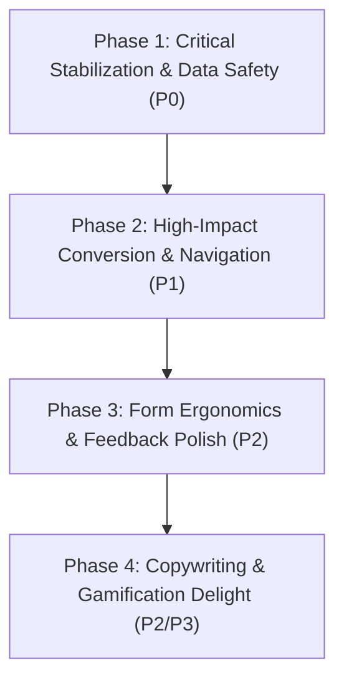

# Goglish Platform — Comprehensive UX/UI Master Audit

> **Document Status:** Official Reference & Single Source of Truth for UX/UI Engineering  
> **Audited by:** Senior Product Designer & UX Systems Engineer  
> **Audited Platform:** Goglish LMS (Next.js 16.3 + React 19 + Tailwind CSS v4 + Supabase)  
> **Target Audience:** Secondary School Students (General Secondary / ثانوية عامة), Parents, Teachers, Administrators

---

## Executive Summary & Metrics

This audit was conducted systematically across all **71 routes and pages**, layouts, shared components, UI primitives, and core user journeys of the Goglish platform. Every problem was evaluated under realistic usage conditions (Desktop, Tablet, Mobile 360px–430px viewports, and full Right-to-Left Arabic `dir="rtl"` layout).

### Quantitative Breakdown

| Metric Category | Count | Definition |
| :--- | :---: | :--- |
| **Total Identified Issues** | **38** | Verified, actionable UX/UI issues across the codebase |
| **Priority 0 (P0 — Critical UX Bug)** | **5** | Causes severe data loss, breaks core functionality, or renders UI completely unreadable |
| **Priority 1 (P1 — Major UX Problem)** | **14** | Significant friction, dead ends, severe mobile usability degradation, or conversion loss |
| **Priority 2 (P2 — Minor UX Problem)** | **17** | Visual inconsistencies, missing feedback, unoptimized interactions, or clumsy micro-flows |
| **Priority 3 (P3 — Nice-to-Have / Polish)** | **2** | Micro-copy typos, aesthetic polish, or minor delight opportunities |
| **Accessibility (a11y) Violations** | **7** | Fails WCAG 2.1 AA/AAA standards (contrast, touch target size, keyboard trapping) |
| **Mobile-Specific Friction** | **10** | Mobile-breaking clipping, thumb-reach failures, or missing mobile viewports |
| **Visual & Styling Inconsistencies** | **6** | Color token mismatches, hardcoded styling bypassing design tokens, or broken grids |
| **Flow, Navigation & State Issues** | **15** | Missing CTAs, dead-end states, lack of error recovery, or confusing user journeys |

---

## User Journey Coverage Matrix

| User Journey | Key Touchpoints | Status | Primary Friction Points Identified |
| :--- | :--- | :---: | :--- |
| **1. Visitor → Registration** | Landing, Auth Cards, Role Selection | ⚠️ Needs Polish | Cursor jumping in RTL inputs, colloquial micro-copy, missing autocomplete |
| **2. Login & Session** | Login, Password Visibility, Device Limit | ⚠️ Needs Polish | `tabIndex={-1}` on password toggle, no autocomplete tags |
| **3. Browse & Discover** | Homepage, Courses List, Search, Filters | ⚠️ Needs Polish | Cramped 2-column mobile grid, empty search state is a blank desert |
| **4. Course Details & Purchase** | Course Page, Sticky CTA, Pricing | 🔴 Major Friction | Missing sticky bottom CTA on mobile; coupon code lacks "Apply" button & discount preview |
| **5. Checkout & Payment** | Daffaa, Manual Transfer, Kashier | 🔴 Major Friction | No copy-to-clipboard for wallet numbers; transfer page ignores coupon discount |
| **6. Student → My Courses** | My Courses, Enrollment Sync, Progress | 🟢 Good | Needs retry button on error state |
| **7. Student → Lesson Player** | Video Player, Tabs, Notes, Resources | 🔴 Major Friction | Mobile curriculum sidebar pushed below comments; site-wide right-click blocked |
| **8. Student → Quiz** | Practice Quiz, Instant Feedback | ⚠️ Needs Polish | Unstyled loading/error text; no way to return to previous question; empty submit allowed |
| **9. Student → Exam** | Timed Exam, Anti-Cheat, Submission | 🔴 Critical Risk | Instant force-submission on tab focus loss (no grace period); no submit confirmation modal |
| **10. Gamification & Honor Board** | Leaderboard, Badges, Podium, Progress | ⚠️ Needs Polish | Logged-in student omitted if outside top ranks; unearned badges lack unlock hints |
| **11. Profile & Account** | Avatar, Grade Select, Active Devices | ⚠️ Needs Polish | Destructive device delete lacks confirmation; onboarding grade dialog confuses students |
| **12. Teacher Experience** | Dashboard, Course Editor, Reviews | ⚠️ Needs Polish | Unwrapped tables break on mobile; empty states lack big CTAs |
| **13. Admin Management** | Users Table, Role Assignment, Revenue | 🔴 Major Friction | User tables lack horizontal scrolling on small screens; critical actions lack confirmation |

---

## Exhaustive Issue Catalog (38 Issues)

### Category 1: Color, Contrast & Visual System

---

#### UX-001 | P0 | Accessibility Issue & Critical Visual Bug
* **Page / Route:** Universal (Global Component)
* **Component / File:** [`app/globals.css`](file:///c:/Users/MK/goglish/app/globals.css) & [`components/ui/badge.tsx`](file:///c:/Users/MK/goglish/components/ui/badge.tsx)
* **Target Audience:** All Users (Students, Instructors, Admins)
* **Viewport:** Both Desktop & Mobile
* **Exact Problem:** In Light Mode (`:root`), `--secondary` is mapped to light grey `oklch(0.97 0 0)` while `--secondary-foreground` is mapped to pure white `#ffffff` (`var(--brand-accent)`). Any badge or button using `variant="secondary"` (such as "مسودة", "مدرس موثّق", "نشط" on devices, and role badges in Admin) renders **white text on near-white background**. Contrast ratio is 1.05:1 (WCAG AA requires at least 4.5:1).
* **Why it hurts the user:** Text is completely invisible to the human eye in normal lighting conditions. Students cannot read instructor verification badges, and admins cannot read user status badges.
* **Recommended Solution:** In `app/globals.css`, change `:root` secondary foreground to dark charcoal/navy: `--secondary-foreground: oklch(0.205 0 0);`. Preserve white text only for `.dark`.
* **Complexity:** Low

---

#### UX-002 | P1 | Visual Inconsistency & Contrast Defect
* **Page / Route:** Universal
* **Component / File:** [`app/globals.css`](file:///c:/Users/MK/goglish/app/globals.css) & [`components/ui/button.tsx`](file:///c:/Users/MK/goglish/components/ui/button.tsx)
* **Target Audience:** All Users
* **Viewport:** Both Desktop & Mobile
* **Exact Problem:** In `:root`, `--primary: oklch(0.205 0 0)` (dark charcoal) while `--primary-foreground: var(--color-secondary)` (#1a1a2e - dark navy). If standard shadcn button variants reference these without custom overrides, dark navy text is printed over dark charcoal background.
* **Why it hurts the user:** Violates brand consistency (Goglish primary is Gold `#f5c518` with Navy `#1a1a2e` text) and leads to visual discordance across buttons.
* **Recommended Solution:** Unify brand color tokens in `@theme inline` so `--primary` is always gold `#f5c518` and `--primary-foreground` is always dark navy `#1a1a2e`.
* **Complexity:** Low

---

#### UX-003 | P2 | Visual Inconsistency & Maintainability Debt
* **Page / Route:** `/quizzes/[id]/attempt`, `/exams/[id]/attempt`
* **Component / File:** [`QuizRunner.tsx`](file:///c:/Users/MK/goglish/app/(learning)/quizzes/[id]/attempt/_components/QuizRunner.tsx), [`ExamRunner.tsx`](file:///c:/Users/MK/goglish/app/(learning)/exams/[id]/attempt/_components/ExamRunner.tsx)
* **Target Audience:** Students
* **Viewport:** Both Desktop & Mobile
* **Exact Problem:** Arbitrary inline CSS classes like `border-black/15`, `dark:border-white/15`, `bg-red-50`, `text-red-700`, and `bg-[var(--color-primary)]` are hardcoded rather than using design tokens (`border-border`, `bg-destructive/10`, `text-destructive`).
* **Why it hurts the user:** Colors look disconnected from the rest of the application and do not adapt cleanly to high contrast or system theme transitions.
* **Recommended Solution:** Replace arbitrary Tailwind classes with standard design tokens (`border-border`, `bg-card`, `bg-primary`, `text-primary-foreground`).
* **Complexity:** Low

---

### Category 2: Browser Hostility & Global Anti-Deterrents

---

#### UX-004 | P0 | Critical UX Bug & Accessibility Violation
* **Page / Route:** Universal (Global Layout)
* **Component / File:** [`components/shared/GlobalDeterrents.tsx`](file:///c:/Users/MK/goglish/components/shared/GlobalDeterrents.tsx)
* **Target Audience:** All Users
* **Viewport:** Desktop & Tablet
* **Exact Problem:** `document.addEventListener("contextmenu", (e) => e.preventDefault())` disables right-clicking across the entire website unconditionally.
* **Why it hurts the user:** Breaks standard web ergonomics: users cannot select Arabic vocabulary to translate via browser dictionaries, cannot use "Open link in new tab", cannot inspect misspelled words via spellcheck, and cannot use password managers or accessibility extensions. Video anti-piracy belongs on the video player canvas, not the global DOM.
* **Recommended Solution:** Remove global `contextmenu` blocking from `GlobalDeterrents.tsx`. Retain deterrence only inside `VideoDeterrents.tsx` scoped to the video player container.
* **Complexity:** Low

---

#### UX-005 | P0 | Critical UX Bug & Data Loss Risk
* **Page / Route:** Universal (Global Layout)
* **Component / File:** [`components/shared/GlobalDeterrents.tsx`](file:///c:/Users/MK/goglish/components/shared/GlobalDeterrents.tsx)
* **Target Audience:** Desktop & Tablet Users
* **Viewport:** Desktop
* **Exact Problem:** `checkDevToolsOpen` monitors the delta between `outerWidth/outerHeight` and `innerWidth/innerHeight`. If the delta exceeds 160px, it executes `window.location.reload()`.
* **Why it hurts the user:** Standard user actions—such as snapping windows to split-screen (`Win + Arrow`), dragging windows between monitors with different DPI scalings, or opening browser extensions/side panels—trigger a surprise full page reload. This causes immediate loss of unsubmitted exam answers, form inputs, and student notes.
* **Recommended Solution:** Remove the automatic `window.location.reload()` heuristic completely. Real video protection is already handled via DRM/signed tokens; client-side size heuristics only punish legitimate students.
* **Complexity:** Low

---

### Category 3: Assessment, Exam & Quiz Experience

---

#### UX-006 | P0 | Critical UX Bug & High-Stakes Penalty
* **Page / Route:** `/exams/[id]/attempt`
* **Component / File:** [`ExamRunner.tsx`](file:///c:/Users/MK/goglish/app/(learning)/exams/[id]/attempt/_components/ExamRunner.tsx)
* **Target Audience:** Students
* **Viewport:** Both (Especially Fatal on Mobile)
* **Exact Problem:** `visibilitychange` listener immediately triggers `forceSubmit()` the millisecond `document.hidden` becomes true.
* **Why it hurts the user:** On mobile, receiving an incoming phone call, pulling down the notification shade, an accidental swipe gesture, or screen auto-lock (after 30 seconds of reading a long comprehension question) instantly force-submits the exam, recording an automatic failure with zero chance to resume.
* **Recommended Solution:** Implement a 10-second Grace Period with a persistent countdown overlay: *"تحذير: لقد غادرت شاشة الامتحان! لديك 10 ثوانٍ للعودة قبل التسليم التلقائي"*. Only force-submit if the student fails to return within the grace window.
* **Complexity:** Medium

---

#### UX-007 | P0 | Major UX Problem & Accidental Destruction
* **Page / Route:** `/exams/[id]/attempt`
* **Component / File:** [`ExamRunner.tsx`](file:///c:/Users/MK/goglish/app/(learning)/exams/[id]/attempt/_components/ExamRunner.tsx)
* **Target Audience:** Students
* **Viewport:** Both (Especially Mobile)
* **Exact Problem:** The "تسليم" (Submit) button immediately executes the submission mutation on click with zero confirmation dialog.
* **Why it hurts the user:** When scrolling on a touch device, an accidental thumb tap submits the entire exam. Students who still have unanswered questions are penalized permanently with no undo.
* **Recommended Solution:** Introduce an `AlertDialog` confirmation modal: show the total number of answered vs. unanswered questions (e.g., *"لديك 3 أسئلة لم تقم بالإجابة عليها، هل أنت متأكد من التسليم النهائي؟"*).
* **Complexity:** Low

---

#### UX-008 | P1 | Major UX Problem & Cognitive Fatigue
* **Page / Route:** `/exams/[id]/attempt`
* **Component / File:** [`ExamRunner.tsx`](file:///c:/Users/MK/goglish/app/(learning)/exams/[id]/attempt/_components/ExamRunner.tsx)
* **Target Audience:** Students
* **Viewport:** Both Desktop & Mobile
* **Exact Problem:** Monolithic presentation: all questions (20 to 60 questions) are rendered simultaneously in a single endless vertical scroll without pagination or an interactive question palette.
* **Why it hurts the user:** Overwhelming cognitive load. Students cannot quickly see which questions they skipped, cannot mark questions for review, and must scroll frantically up and down.
* **Recommended Solution:** Add a sticky Question Navigation Grid (Numbered buttons 1..N) indicating: Answered (Green), Unanswered (Muted), Flagged for Review (Yellow), with smooth jump-to-anchor functionality.
* **Complexity:** Medium

---

#### UX-009 | P1 | Major UX Problem & One-Way Navigation Trap
* **Page / Route:** `/quizzes/[id]/attempt`
* **Component / File:** [`QuizRunner.tsx`](file:///c:/Users/MK/goglish/app/(learning)/quizzes/[id]/attempt/_components/QuizRunner.tsx)
* **Target Audience:** Students
* **Viewport:** Both Desktop & Mobile
* **Exact Problem:** Once a student advances via "السؤال التالي", there is no "السؤال السابق" button to review earlier questions or explanations.
* **Why it hurts the user:** Learning is an iterative process. If a student wants to re-read an explanation or verify how a concept was phrased in a previous question, they are permanently locked out.
* **Recommended Solution:** Add a "السؤال السابق" button allowing students to step backward through already-checked questions in read-only mode.
* **Complexity:** Low

---

#### UX-010 | P1 | Accessibility & Mobile Touch Target Violation
* **Page / Route:** `/quizzes/[id]/attempt`, `/exams/[id]/attempt`
* **Component / File:** [`QuestionRenderer.tsx`](file:///c:/Users/MK/goglish/app/(learning)/_components/QuestionRenderer.tsx)
* **Target Audience:** Students
* **Viewport:** Mobile & Tablet
* **Exact Problem:** MCQ choices use raw browser 16px `<input type="radio">` wrapped in a plain flex label without card borders or active styling.
* **Why it hurts the user:** Extremely difficult to tap accurately on mobile screens while on the move or holding a phone with one hand. Violates WCAG 2.5.5 target size requirements (minimum 44x44px).
* **Recommended Solution:** Wrap each MCQ option in a full-width selectable Card: `p-3.5 rounded-xl border-2 transition-all cursor-pointer hover:border-primary/50`, with distinct selected state (`border-primary bg-primary/10`).
* **Complexity:** Low

---

#### UX-011 | P2 | Minor UX Problem & Accidental Error
* **Page / Route:** `/quizzes/[id]/attempt`
* **Component / File:** [`QuizRunner.tsx`](file:///c:/Users/MK/goglish/app/(learning)/quizzes/[id]/attempt/_components/QuizRunner.tsx)
* **Target Audience:** Students
* **Viewport:** Both Desktop & Mobile
* **Exact Problem:** Clicking "تحقق من الإجابة" without selecting any answer immediately submits `{ response: "" }` and burns the question as incorrect.
* **Why it hurts the user:** Punishes accidental clicks before the student has decided on an answer.
* **Recommended Solution:** Disable the "تحقق من الإجابة" button until a valid answer is selected, or display a gentle inline toast: *"يرجى اختيار إجابة أولاً"*.
* **Complexity:** Low

---

#### UX-012 | P2 | Visual & Feedback Degradation
* **Page / Route:** `/quizzes/[id]/attempt`, `/exams/[id]/attempt`
* **Component / File:** [`QuizRunner.tsx`](file:///c:/Users/MK/goglish/app/(learning)/quizzes/[id]/attempt/_components/QuizRunner.tsx), [`ExamRunner.tsx`](file:///c:/Users/MK/goglish/app/(learning)/exams/[id]/attempt/_components/ExamRunner.tsx)
* **Target Audience:** Students
* **Viewport:** Both Desktop & Mobile
* **Exact Problem:** Loading and error states render unstyled bare text tags: `
جاري تحميل الكويز...
` and `
{errorMessage}
`.
* **Why it hurts the user:** Looks unfinished, like a broken browser error, causing doubt regarding site stability.
* **Recommended Solution:** Use standard `Skeleton` pulse cards for loading, and an `Alert` / `Card` with a refresh/retry button for error states.
* **Complexity:** Low

---

### Category 4: E-Commerce, Checkout & Pricing Flows

---

#### UX-013 | P1 | Major UX Problem & Conversion Drop
* **Page / Route:** `/courses/[id]`
* **Component / File:** [`CoursePage`](file:///c:/Users/MK/goglish/app/(marketing)/courses/[id]/page.tsx)
* **Target Audience:** Prospective Students & Parents
* **Viewport:** Both Desktop & Mobile
* **Exact Problem:** The coupon code input field has no "تطبيق" (Apply) button. The user enters a code, but nothing happens on screen: no validation feedback, no confirmation toast, and the displayed price does not update.
* **Why it hurts the user:** Users assume the coupon did not work or is invalid. They hesitate to click "اشترك الآن" fearing they will be charged the full amount on the gateway.
* **Recommended Solution:** Add an inline "تطبيق" button calling `/api/coupons/validate`. On success, show the discount amount, strike through the old price, show the discounted total, and display a badge: `تم تطبيق خصم 20% 🎉`.
* **Complexity:** Medium

---

#### UX-014 | P1 | Mobile Conversion Killer
* **Page / Route:** `/courses/[id]`
* **Component / File:** [`CoursePage`](file:///c:/Users/MK/goglish/app/(marketing)/courses/[id]/page.tsx)
* **Target Audience:** Mobile Visitors & Students
* **Viewport:** Mobile
* **Exact Problem:** On mobile viewports (`< lg`), the sticky purchase card drops to the very bottom of the page beneath the trailer video, description, objectives, instructor bio, syllabus modules, and reviews.
* **Why it hurts the user:** A visitor browsing on their phone must scroll through hundreds of pixels just to find the price and the "اشترك الآن" button. Many abandon before reaching the bottom.
* **Recommended Solution:** Implement a fixed bottom action bar on mobile (`fixed bottom-0 inset-x-0 bg-background/95 border-t p-3 z-30 lg:hidden`) showing the price, currency, and a prominent "اشترك الآن" button.
* **Complexity:** Medium

---

#### UX-015 | P1 | Mobile Checkout Friction & Dropoff
* **Page / Route:** `/checkout/daffaa/[paymentId]`
* **Component / File:** [`DaffaaCheckoutContent`](file:///c:/Users/MK/goglish/app/checkout/daffaa/[paymentId]/page.tsx)
* **Target Audience:** Students paying via Vodafone Cash / InstaPay
* **Viewport:** Mobile
* **Exact Problem:** Wallet and InstaPay numbers are displayed as static text without a "نسخ الرقم" (Copy) button.
* **Why it hurts the user:** Students must switch between Vodafone Cash/InstaPay and the browser while trying to select and copy an 11-digit number on a small screen. Typing errors lead to failed transfers.
* **Recommended Solution:** Add a prominent "نسخ" button with a `Copy` icon next to every wallet and InstaPay handle that copies the string and triggers a confirmation toast.
* **Complexity:** Low

---

#### UX-016 | P2 | Financial Misalignment & User Confusion
* **Page / Route:** `/checkout/transfer/[id]`
* **Component / File:** [`ManualTransferPage`](file:///c:/Users/MK/goglish/app/(marketing)/checkout/transfer/[id]/page.tsx)
* **Target Audience:** Students
* **Viewport:** Both Desktop & Mobile
* **Exact Problem:** The manual transfer page reads `coupon` from `searchParams`, but calculates the displayed transfer price strictly using `course.price_cents / 100`, ignoring any coupon discount.
* **Why it hurts the user:** If a student applied a coupon for 150 EGP (originally 200 EGP) and chose manual wallet transfer, the instructions instruct them to transfer the full 200 EGP.
* **Recommended Solution:** Validate the coupon on the transfer page and display the discounted transfer amount in the WhatsApp pre-filled message and price card.
* **Complexity:** Medium

---

#### UX-017 | P2 | Micro-Interaction Degradation
* **Page / Route:** `/checkout/daffaa/[paymentId]`
* **Component / File:** [`DaffaaCheckoutContent`](file:///c:/Users/MK/goglish/app/checkout/daffaa/[paymentId]/page.tsx)
* **Target Audience:** Students
* **Viewport:** Both Desktop & Mobile
* **Exact Problem:** `window.location.href = successUrl` is used after confirming the payment reference, causing a full browser re-render.
* **Why it hurts the user:** Causes page flicker and re-downloads assets instead of smooth client-side SPA navigation.
* **Recommended Solution:** Use Next.js `router.push(successUrl)` for instant transition.
* **Complexity:** Low

---

### Category 5: Navigation, Wayfinding & Hierarchy

---

#### UX-018 | P1 | Major Wayfinding Problem & Lost Users
* **Page / Route:** Universal (Landing & Marketing Header)
* **Component / File:** [`components/layout/Navbar.tsx`](file:///c:/Users/MK/goglish/components/layout/Navbar.tsx)
* **Target Audience:** Authenticated Students & Teachers
* **Viewport:** Both Desktop & Mobile
* **Exact Problem:** When a logged-in user visits the homepage, the Navbar only shows their name linking to `/profile`. There is **no link or CTA to "كورساتي" (My Courses) or "لوحة التحكم" (Dashboard)**.
* **Why it hurts the user:** Returning students looking to continue their studies are stranded on the landing page and must either open their profile first or manually type `/student/my-courses`.
* **Recommended Solution:** In the Navbar, replace the passive profile button with a prominent CTA: `"كورساتي" / "لوحة التحكم"` for authenticated students, keeping the avatar as a dropdown menu.
* **Complexity:** Low

---

#### UX-019 | P1 | Major Mobile Learning UX Problem
* **Page / Route:** `/lessons/[id]`
* **Component / File:** [`app/(learning)/lessons/[id]/page.tsx`](file:///c:/Users/MK/goglish/app/(learning)/lessons/[id]/page.tsx)
* **Target Audience:** Students
* **Viewport:** Mobile & Tablet
* **Exact Problem:** On mobile screens, `<aside>` containing `CourseNavSidebar` renders at the bottom of the page, below the video player, progress bar, lesson notes, and comments section.
* **Why it hurts the user:** Navigating to the next lesson or viewing other chapters requires scrolling past the entire comments section on mobile.
* **Recommended Solution:** Add a collapsible mobile drawer / sheet triggered by a sticky header button: `"فهرس الدروس"` with an icon and chapter progress badge.
* **Complexity:** Medium

---

#### UX-020 | P2 | Dead-End Micro-Interactions
* **Page / Route:** `/admin/dashboard`
* **Component / File:** [`AdminOverviewPage`](file:///c:/Users/MK/goglish/app/(admin)/admin/dashboard/page.tsx)
* **Target Audience:** Administrators
* **Viewport:** Both Desktop & Mobile
* **Exact Problem:** Metric stat cards (e.g., "تعليقات في انتظار المراجعة: 14", "محتوى في انتظار الموافقة: 3") are static cards without navigation links.
* **Why it hurts the user:** Admins see an urgent pending item but cannot click the card to jump directly to the moderation queue or review queue.
* **Recommended Solution:** Make every stat card an interactive link/card leading to its corresponding management view (e.g., `/admin/comments`, `/admin/courses`).
* **Complexity:** Low

---

#### UX-021 | P2 | Unclear Student Next Steps
* **Page / Route:** `/student/dashboard`
* **Component / File:** [`components/dashboard/widgets/ContinueSection.tsx`](file:///c:/Users/MK/goglish/components/dashboard/widgets/ContinueSection.tsx)
* **Target Audience:** Students
* **Viewport:** Both Desktop & Mobile
* **Exact Problem:** If a student just finished a module, the card displays progress but does not prominently state the title of the next lesson waiting for them.
* **Why it hurts the user:** Increases hesitation; students have to open the course curriculum to figure out what they should study next.
* **Recommended Solution:** Explicitly display: `"الدرس القادم: [اسم الدرس]"` with a direct 1-click `"ابدأ الآن"` button.
* **Complexity:** Low

---

### Category 6: Forms, Inputs, Validation & RTL

---

#### UX-022 | P1 | Disorienting RTL Typing & Cursor Jumps
* **Page / Route:** `/login`, `/register`, `/forgot-password`, `/profile`
* **Component / File:** [`app/(auth)/login/page.tsx`](file:///c:/Users/MK/goglish/app/(auth)/login/page.tsx), [`register/page.tsx`](file:///c:/Users/MK/goglish/app/(auth)/register/page.tsx)
* **Target Audience:** All Users
* **Viewport:** Both Desktop & Mobile
* **Exact Problem:** Email and phone inputs inherit `dir="rtl"` from `<html>`.
* **Why it hurts the user:** Typing punctuation like `@`, dots (`.`), or country codes (`+20`) in an RTL input causes the browser cursor to jump erratically between the left and right edges, disorienting users and causing typos.
* **Recommended Solution:** Explicitly set `dir="ltr"` and `className="text-start"` on all email, password, phone, URL, and national ID inputs.
* **Complexity:** Low

---

#### UX-023 | P2 | Mobile Typing Friction
* **Page / Route:** `/login`, `/register`, `/forgot-password`
* **Component / File:** [`app/(auth)/login/page.tsx`](file:///c:/Users/MK/goglish/app/(auth)/login/page.tsx), [`register/page.tsx`](file:///c:/Users/MK/goglish/app/(auth)/register/page.tsx)
* **Target Audience:** All Users
* **Viewport:** Both Desktop & Mobile
* **Exact Problem:** Missing standard browser autocomplete attributes (`autoComplete="email"`, `autoComplete="current-password"`, `autoComplete="new-password"`, `autoComplete="tel"`).
* **Why it hurts the user:** Mobile keyboards and browser password managers cannot auto-fill credentials with one tap, forcing tedious manual typing.
* **Recommended Solution:** Add standard `autoComplete` attributes to all form fields.
* **Complexity:** Low

---

#### UX-024 | P2 | Accessibility Violation (Keyboard Navigation)
* **Page / Route:** Universal (Login, Register, Reset Password)
* **Component / File:** [`components/ui/password-input.tsx`](file:///c:/Users/MK/goglish/components/ui/password-input.tsx)
* **Target Audience:** Keyboard & Assistive Technology Users
* **Viewport:** Desktop & Tablet
* **Exact Problem:** The show/hide password toggle button has `tabIndex={-1}` hardcoded.
* **Why it hurts the user:** Users who rely on the keyboard (Tab key) or screen readers cannot focus or toggle password visibility. Violates WCAG 2.1.1 (Keyboard Accessible).
* **Recommended Solution:** Remove `tabIndex={-1}` and ensure proper `focus-visible` outline rings are present on the toggle button.
* **Complexity:** Low

---

#### UX-025 | P2 | Misleading Micro-Interaction State
* **Page / Route:** `/login`, `/register`, `/complete-profile`
* **Component / File:** [`app/(auth)/_components/Field.tsx`](file:///c:/Users/MK/goglish/app/(auth)/_components/Field.tsx)
* **Target Audience:** All Users
* **Viewport:** Both Desktop & Mobile
* **Exact Problem:** `<SubmitButton disabled={disabled}>` unconditionally renders `<Loader2 className="animate-spin" />` whenever `disabled` is true, even if the button is merely disabled due to an invalid form rather than active submission.
* **Why it hurts the user:** Users see a spinning loader on an empty or invalid form, making them believe the server is hanging or loading in the background.
* **Recommended Solution:** Separate `isSubmitting` (or `loading`) from `disabled`. Only render the spinner when `isSubmitting` is explicitly true.
* **Complexity:** Low

---

### Category 7: Empty, Error & Recovery States

---

#### UX-026 | P2 | Cold & Unhelpful Empty States
* **Page / Route:** `/student/wishlist`, `/bundles`, `/student/notifications`, `/teacher/dashboard`
* **Component / File:** [`WishlistPage`](file:///c:/Users/MK/goglish/app/(dashboard)/student/wishlist/page.tsx), [`BundlesPage`](file:///c:/Users/MK/goglish/app/(marketing)/bundles/page.tsx)
* **Target Audience:** Students & Teachers
* **Viewport:** Both Desktop & Mobile
* **Exact Problem:** Empty data views render a single, unstyled grey text line: `"لا يوجد كورسات مفضّلة بعد"` or `"مفيش باقات متاحة دلوقتي"`.
* **Why it hurts the user:** Dead ends. There is no visual interest and no Call-to-Action button to guide the user to the next logical step (e.g., `"تصفح الكورسات الآن"`).
* **Recommended Solution:** Build a unified `EmptyState` component with a subtle illustration/icon, a friendly explanatory sentence, and an action button directing the user to explore available courses.
* **Complexity:** Low

---

#### UX-027 | P1 | Missing Error Recovery & Dead End
* **Page / Route:** `/courses/[id]`, `/student/dashboard`, `/teachers`, `/bundles`
* **Component / File:** Multiple marketing and dashboard routes
* **Target Audience:** All Users
* **Viewport:** Both Desktop & Mobile
* **Exact Problem:** When a query fails (`isError === true`), pages render a static message: `"تعذر تحميل الكورس، يرجى المحاولة لاحقاً"` with no "إعادة المحاولة" (Retry) button.
* **Why it hurts the user:** If a momentary mobile network glitch drops a request, the user is trapped and forced to perform a full manual browser refresh, losing their current context.
* **Recommended Solution:** Include a standardized `"إعادة المحاولة"` (Retry) button that triggers TanStack Query's `refetch()`.
* **Complexity:** Low

---

#### UX-028 | P2 | Unassisted Search Blank Slate
* **Page / Route:** `/student/search`
* **Component / File:** [`SearchPage`](file:///c:/Users/MK/goglish/app/(dashboard)/student/search/page.tsx)
* **Target Audience:** Students
* **Viewport:** Both Desktop & Mobile
* **Exact Problem:** When the search input is empty, the screen displays a blank area with `"اكتب عشان تبدأ البحث."`.
* **Why it hurts the user:** Wasted real estate. Students often don't know what to search for without discovery prompts.
* **Recommended Solution:** Display popular search tags (e.g., "مراجعة نهائية", "لغة إنجليزية", "كيمياء"), subject badges, and top-rated teachers as quick-tap filters when the query is empty.
* **Complexity:** Medium

---

### Category 8: Responsive Layouts & Table Ergonomics

---

#### UX-029 | P1 | Mobile & Tablet Table Clipping
* **Page / Route:** `/admin/users`, `/teacher/dashboard`
* **Component / File:** [`AdminUsersPage`](file:///c:/Users/MK/goglish/app/(admin)/admin/users/page.tsx), [`TeacherContentOverviewPage`](file:///c:/Users/MK/goglish/app/(teacher)/teacher/dashboard/page.tsx)
* **Target Audience:** Administrators & Teachers
* **Viewport:** Mobile & Tablet
* **Exact Problem:** Tables containing 8+ columns are placed inside containers with `overflow-hidden` rather than `overflow-x-auto`.
* **Why it hurts the user:** Columns get crushed into an unreadable vertical pile, and right-most action buttons ("إجراءات", "إدارة") are pushed completely off-screen and become unclickable on iPads or mobile devices.
* **Recommended Solution:** Wrap all data tables in `
` with proper minimum column widths.
* **Complexity:** Low

---

#### UX-030 | P2 | Cramped Mobile 2-Column Course Grid
* **Page / Route:** `/courses`
* **Component / File:** [`CoursesList.tsx`](file:///c:/Users/MK/goglish/components/marketing/CoursesList.tsx), [`CourseCard.tsx`](file:///c:/Users/MK/goglish/components/marketing/CourseCard.tsx)
* **Target Audience:** Mobile Users
* **Viewport:** Small Mobile (< 380px)
* **Exact Problem:** `grid-cols-2` forces course cards into ~130px width on entry-level Android devices. Card padding (`p-4`), badges, title, and button icons cause severe text wrapping and title truncation after only 5 Arabic characters.
* **Why it hurts the user:** The course catalog looks broken and cluttered on smaller phones.
* **Recommended Solution:** Use `grid-cols-1 sm:grid-cols-2 lg:grid-cols-3 xl:grid-cols-4` on narrow mobile screens (< 380px) so course cards render with readable typography and clean touch targets.
* **Complexity:** Low

---

### Category 9: Administrative & Destructive Action Safety

---

#### UX-031 | P1 | Dangerous Unconfirmed Destructive Actions
* **Page / Route:** `/admin/users`, `/student/profile`
* **Component / File:** [`UserManageDialog.tsx`](file:///c:/Users/MK/goglish/components/admin/UserManageDialog.tsx), [`DevicesSection.tsx`](file:///c:/Users/MK/goglish/components/dashboard/DevicesSection.tsx)
* **Target Audience:** Admins & Students
* **Viewport:** Both Desktop & Mobile
* **Exact Problem:** High-stakes actions—such as "حذف الحساب" (Soft Delete User), revoking an admin role ("×"), and kicking an active device—execute immediately on a single click without confirmation.
* **Why it hurts the user:** A misclick by an administrator can immediately deactivate a live student or revoke admin privileges. A student tapping their phone screen can accidentally delete their own active phone login.
* **Recommended Solution:** Protect all destructive actions behind an `AlertDialog` requiring deliberate confirmation (e.g., *"هل أنت متأكد من حذف حساب الطالب ونقله لسلة المحذوفات؟"*).
* **Complexity:** Low

---

#### UX-032 | P2 | Tedious Notification Management
* **Page / Route:** `/student/notifications`
* **Component / File:** [`StudentNotificationsPage`](file:///c:/Users/MK/goglish/app/(dashboard)/student/notifications/page.tsx)
* **Target Audience:** Students
* **Viewport:** Both Desktop & Mobile
* **Exact Problem:** There is no "تحديد الكل كمقروء" (Mark All as Read) button.
* **Why it hurts the user:** If a student accumulates 15 notifications, they must tap every single card individually to clear unread badges.
* **Recommended Solution:** Add a `"تحديد الكل كمقروء"` action button in the page header.
* **Complexity:** Low

---

### Category 10: Copywriting, Tone & Localization

---

#### UX-033 | P2 | Inconsistent Tone & Dialect Clashes
* **Page / Route:** Across multiple pages (Auth, Quiz, Marketing)
* **Component / File:** Global copy across multiple components
* **Target Audience:** All Users
* **Viewport:** Both Desktop & Mobile
* **Exact Problem:** Unregulated mixing of formal Modern Standard Arabic, colloquial Egyptian street dialect, and transliterated English across the same view:
  - Auth: *"الإيميل"* & *"الباسورد"* alongside *"رجعت تكمل الطريق"*.
  - Quiz: *"مبروك، نجحت!"* alongside *"للأسف مانجحتش"* and *"إجابة غلط"*.
  - Landing Slider: `aria-label="اللي بعده"` and `aria-label="اللي قبله"`.
  - Bundles: *"مفيش باقات متاحة دلوقتي"*.
* **Why it hurts the user:** Undermines educational credibility and feels unprofessional for a high-school platform preparing students for national exams.
* **Recommended Solution:** Standardize on a **Friendly Modern Standard Arabic (فصحى معاصرة ودودة ومبسطة)**:
  - Use *"البريد الإلكتروني"* instead of *"الإيميل"*.
  - Use *"كلمة المرور"* instead of *"الباسورد"*.
  - Use *"التالي"* and *"السابق"* for accessibility labels.
  - Use *"لم تجتز الاختبار بعد، يمكنك المحاولة مرة أخرى"* instead of *"مانجحتش"*.
* **Complexity:** Low

---

#### UX-034 | P1 | Misleading Instructions in Parent Portal
* **Page / Route:** `/parent/dashboard`
* **Component / File:** [`ParentOverviewPage`](file:///c:/Users/MK/goglish/app/(parent)/parent/dashboard/page.tsx)
* **Target Audience:** Parents
* **Viewport:** Both Desktop & Mobile
* **Exact Problem:** The card description tells parents: *"مفيش أبناء مرتبطين بحسابك حالياً. اربط ابنك بالرقم القومي بتاعه"* (Connect your child using their National ID), but the input placeholder and label beneath it demand: *"رقم هاتف الطالب المسجل به في المنصة"* (Student's Phone Number).
* **Why it hurts the user:** Parents enter their child's 14-digit National ID into a phone field, which triggers validation errors and causes immediate frustration.
* **Recommended Solution:** Fix the copy to match the backend requirement: *"أدخل رقم الهاتف المسجل به حساب الطالب لإرسال طلب الربط"*.
* **Complexity:** Low

---

#### UX-035 | P3 | Grammar Typo in Status Badge
* **Page / Route:** `/parent/dashboard`
* **Component / File:** [`ParentOverviewPage`](file:///c:/Users/MK/goglish/app/(parent)/parent/dashboard/page.tsx)
* **Target Audience:** Parents
* **Viewport:** Both Desktop & Mobile
* **Exact Problem:** Badge displays `"الطلب اتفض"` (missing the letter 'ر').
* **Why it hurts the user:** Typo in an official state badge.
* **Recommended Solution:** Correct the string to `"تم رفض الطلب"`.
* **Complexity:** Low

---

### Category 11: Gamification & Onboarding UX

---

#### UX-036 | P2 | Intimidating Onboarding Friction
* **Page / Route:** `/student/choose-grade`
* **Component / File:** [`ChooseGradePage`](file:///c:/Users/MK/goglish/app/(dashboard)/student/choose-grade/page.tsx)
* **Target Audience:** Newly Registered Students
* **Viewport:** Both Desktop & Mobile
* **Exact Problem:** New students who just signed up and land on `/choose-grade` are shown the `GradeChangeSection`, which pops up a cautionary modal: *"تأكيد تغيير الصف الدراسي: جميع الاقتراحات والكورسات ستتغير بناءً على الصف الجديد. متأكد؟"*.
* **Why it hurts the user:** Confusing and intimidating for someone selecting their initial grade for the very first time. They aren't "changing" anything.
* **Recommended Solution:** For initial onboarding, render 3 clean selectable cards (أولى ثانوي، ثانية ثانوي، ثالثة ثانوي) with 1-click selection without opening a change-warning modal.
* **Complexity:** Low

---

#### UX-037 | P2 | Gamification Disconnect for Non-Top Students
* **Page / Route:** `/leaderboard`, `/student/leaderboard`
* **Component / File:** [`LeaderboardContent.tsx`](file:///c:/Users/MK/goglish/components/leaderboard/LeaderboardContent.tsx)
* **Target Audience:** Students
* **Viewport:** Both Desktop & Mobile
* **Exact Problem:** If a student is ranked #140, they are completely invisible on the leaderboard view because only the top 50 rows are loaded.
* **Why it hurts the user:** Gamification fails if average students cannot track their own progress or see how many XP points they need to reach the next tier.
* **Recommended Solution:** Pin a persistent sticky card at the bottom of the leaderboard showing the logged-in student's personal position: `ترتيبك الحالي: #140 • 450 XP • متبقي 50 XP للمركز القادم`.
* **Complexity:** Medium

---

#### UX-038 | P3 | Cryptic Achievement Progression
* **Page / Route:** `/achievements`
* **Component / File:** [`app/(marketing)/achievements/page.tsx`](file:///c:/Users/MK/goglish/app/(marketing)/achievements/page.tsx)
* **Target Audience:** Students
* **Viewport:** Both Desktop & Mobile
* **Exact Problem:** Locked/unearned badges are simply grayed out at 40% opacity. They cannot be clicked and provide no progress indicator (e.g., "شاهدت 3 من 10 دروس").
* **Why it hurts the user:** Students lose interest in gamification badges if they don't know what concrete actions are needed to unlock them.
* **Recommended Solution:** Make locked badge cards clickable to display a modal or tooltip with exact criteria and a progress bar.
* **Complexity:** Low

---

## Strategic Implementation Roadmap

We recommend executing the fixes in **4 structured phases**:

### Phase 1: Critical Stabilization & Data Safety (P0) — Immediate Priority
1. **UX-001:** Fix `:root` secondary foreground in `globals.css` to eliminate invisible text on badges/buttons.
2. **UX-004 & UX-005:** Remove global `contextmenu` blocking and window-resize auto-reloads from `GlobalDeterrents.tsx`.
3. **UX-006:** Implement the 10-second grace period on exam tab switches in `ExamRunner.tsx`.
4. **UX-007:** Add confirmation modal before exam submission in `ExamRunner.tsx`.

### Phase 2: High-Impact Conversion & Navigation (P1)
1. **UX-013 & UX-014:** Add coupon "Apply" button with live discount calculation and sticky bottom enroll bar on mobile course pages.
2. **UX-015:** Add 1-tap "Copy" button for wallet and InstaPay numbers in Daffaa checkout.
3. **UX-018:** Provide prominent "كورساتي" / "لوحة التحكم" navigation in the main header for logged-in users.
4. **UX-019:** Add mobile drawer/sheet for curriculum navigation in lesson pages.
5. **UX-022:** Set `dir="ltr"` and `text-start` on email, phone, and password inputs.
6. **UX-029 & UX-031:** Fix table horizontal scrolling and wrap admin destructive actions in `AlertDialog`.
7. **UX-034:** Align parent child linking instructions with actual phone input requirements.

### Phase 3: Form Ergonomics, Feedback & Component States (P2)
1. **UX-008 & UX-009:** Add Question Navigation Grid for exams and backward navigation for quizzes.
2. **UX-010:** Upgrade MCQ radio buttons into full-width selectable option cards.
3. **UX-011 & UX-012:** Block empty quiz submission and upgrade raw text loading/error states to Skeletons/Alerts.
4. **UX-020 & UX-021:** Make admin dashboard stat cards interactive and clarify next lesson CTAs on student dashboards.
5. **UX-024 & UX-025:** Fix password toggle keyboard accessibility and decouple submit button spinner from disabled state.
6. **UX-026 & UX-027:** Implement unified `EmptyState` cards with CTAs and add "إعادة المحاولة" (Retry) buttons to error states.
7. **UX-028 & UX-030:** Add search discovery prompts and optimize mobile course grid layout.

### Phase 4: Tone of Voice & Gamification Delight (P2 / P3)
1. **UX-033 & UX-035:** Unify platform copywriting to modern friendly Arabic and fix status typos.
2. **UX-036:** Streamline onboarding grade selection without change-warning modals.
3. **UX-037 & UX-038:** Pin logged-in student rank on leaderboard and add progress tooltips to locked achievement badges.
